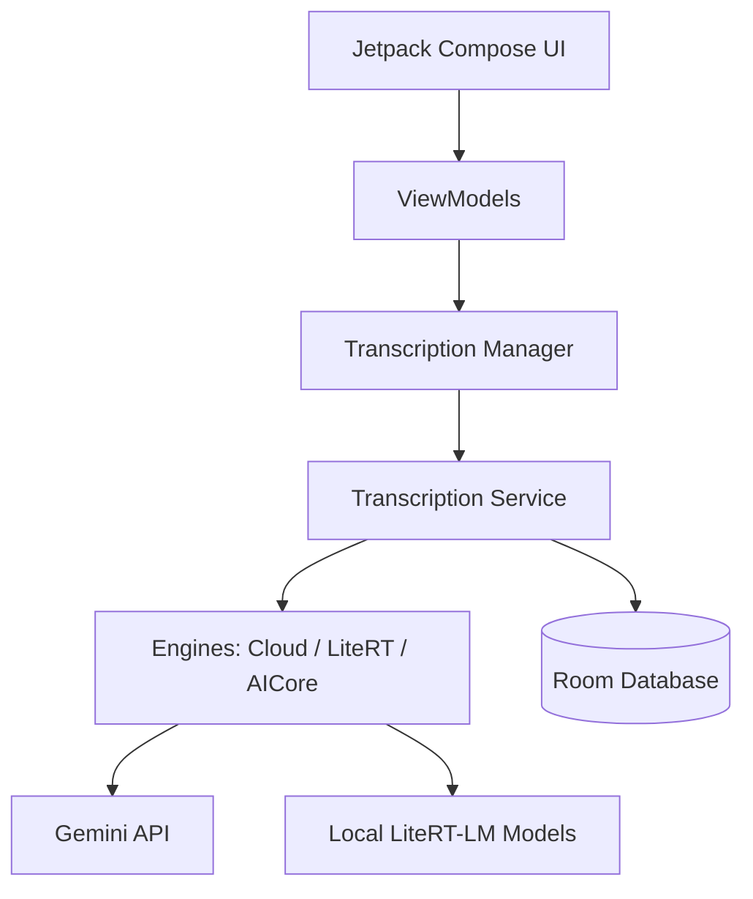

<p align="center">
  
</p>

# Transcriber

A privacy-focused Android application for high-quality audio transcription and text refinement. Transcriber lets users choose between offline on-device processing with LiteRT-LM and cloud transcription with Gemini.

## Features

- **Hybrid transcription engines**: choose Gemini Cloud for high accuracy, LiteRT-LM or Whisper.cpp for private offline transcription.
- **Single-pass Gemini refinement**: Gemini Cloud transcribes and refines in one multimodal request, returning the final cleaned text directly.
- **Multiple concurrent transcriptions**: each transcription gets its own foreground notification and progress state.
- **Notification controls**: reopen a specific transcription from its notification, cancel an ongoing job, or copy the final transcript directly from the completed notification.
- **Background execution**: send only the Transcriber dialog to background while the source app stays in the foreground.
- **Transcription history**: store, search, copy, and delete previous transcriptions locally with Room.
- **On-device model manager**: download, select, and delete LiteRT-LM and Whisper.cpp models inside the app.
- **In-app updates**: check GitHub releases manually, view markdown changelogs, and install APK updates.
- **Italian localization**: full Italian translation with a runtime language selector in Settings (System Default / English / Italian).

## Tech Stack

| Category | Technology |
| --- | --- |
| UI | Jetpack Compose / Material 3 |
| Cloud AI | Google Generative AI SDK (Gemini) |
| On-device AI | LiteRT / LiteRT-LM |
| Database | Room |
| Preferences | Jetpack DataStore |
| Architecture | MVVM with a foreground transcription service |

## Architecture



- **UI**: Compose screens and dialogs for setup, progress, history, settings, and model management.
- **TranscriptionManager**: shared in-memory state for active and completed transcription jobs.
- **TranscriptionService**: foreground service that runs one or more transcription jobs and owns their notifications.
- **Engines**: strategy implementations for Gemini Cloud, LiteRT-LM, and future AICore support.
- **Data layer**: Room for history and DataStore for preferences.

## Getting Started

### Prerequisites

- Android Studio Ladybug or newer.
- Android SDK 35.
- A device or emulator running Android 8.0 (API 26) or higher.

### Installation

1. Clone the repository along with its submodules:

   ```bash
   git clone --recursive https://github.com/CorsiDanilo/simple-transcription-app
   ```

   *Note: If you have already cloned the repository without the `--recursive` flag, you can initialize and download the submodules by running:*

   ```bash
   git submodule update --init --recursive
   ```

2. Open the project in Android Studio.
3. Add your Gemini API key to `local.properties` if you want cloud features:

   ```properties
   GEMINI_API_KEY=your_api_key_here
   ```

4. Sync Gradle and run the app.

## Usage

1. Choose an engine in Settings: Gemini Cloud, LiteRT-LM, or AICore where available.
2. Share an audio file to Transcriber or start from the app flow.
3. Watch progress in the dialog or notification.
4. Run several transcriptions in parallel when needed; each job has its own notification.
5. Copy the completed text from the dialog, history, or completion notification.

## Release Process

Releases are versioned in `app/build.gradle.kts` and documented in `CHANGELOG.md`. Pushing a tag such as `v1.1.1` triggers the GitHub Actions release pipeline.

## License

This project is licensed under the MIT License.
