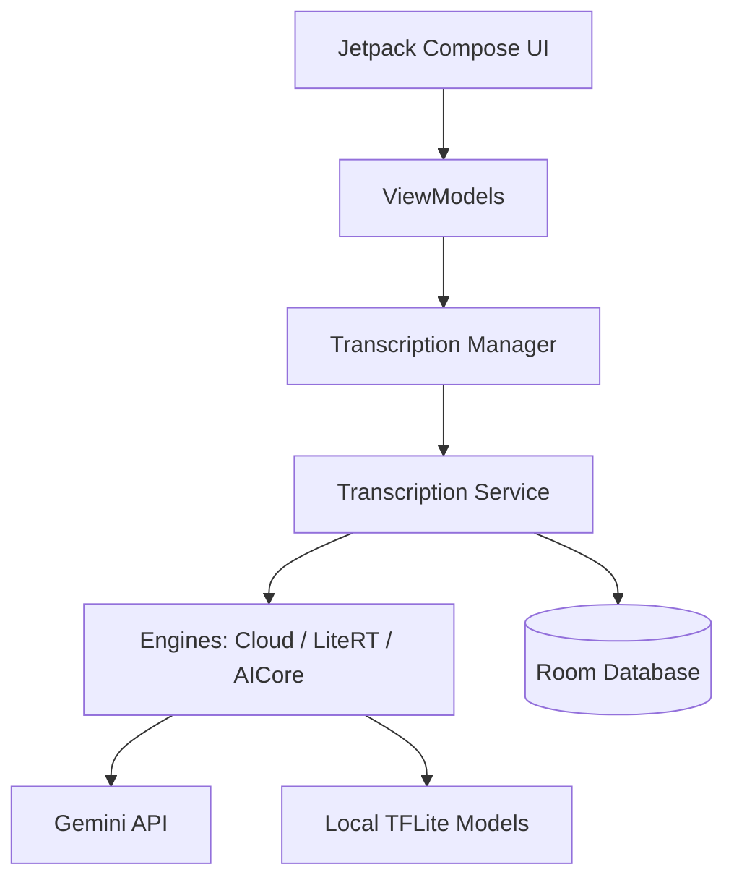

<p align="center">
  
</p>

# Transcriber 🎙️✨

A powerful, privacy-focused Android application for high-quality audio transcription and text refinement. **Transcriber** combines the speed of on-device AI with the power of the cloud to deliver accurate results for any situation.

---

## 🚀 Features

- **Hybrid Transcription Engine**: Choose between **LiteRT-LM** for 100% offline, private transcription or **Gemini Cloud** for state-of-the-art accuracy.
- **Smart Refinement**: Automatically fix grammar, punctuation, and syntax using Gemini AI after the initial transcription.
- **Background Execution + Live Notification**: A persistent notification appears when you send the dialog to background and updates with transcription/refinement progress.
- **On-Device AI Catalog**: Download and manage various LiteRT models (like Gemma 2B/4B) directly within the app.
- **Transcription History**: Keep track of all your past transcriptions with a searchable local database powered by Room.
- **In-App Auto Updates**: Always stay up-to-date with the latest features fetching releases directly from GitHub.
- **Material You Design**: A modern, dynamic interface built with Jetpack Compose that respects your system theme.
- **Privacy First**: Choose on-device models to ensure your audio never leaves your phone.

---

## 🛠️ Tech Stack

This project leverages the latest Android development technologies:

| Category          | Technology                                                                 |
|-------------------|---------------------------------------------------------------------------|
| **UI Framework**  | Jetpack Compose / Material 3 (Material You)                               |
| **AI (Cloud)**    | Google Generative AI SDK (Gemini)                                         |
| **AI (On-Device)** | LiteRT (formerly TensorFlow Lite) / LiteRT-LM                             |
| **Local Database**| Room Persistence Library                                                  |
| **Data Persistence**| Jetpack DataStore (Preferences)                                         |
| **Networking**    | OkHttp & Kotlin Serialization                                             |
| **Architecture**  | MVVM (Model-View-ViewModel)                                               |

---

## 🏛️ Architecture

The app is built with a focus on modularity and separation of concerns:



- **UI**: Reactive components built with Compose.
- **Service**: Foreground service to handle long-running transcription tasks even when the app is in the background.
- **Engines**: Abstraction layer allowing seamless switching between different transcription technologies.
- **Data**: Centralized management of settings (DataStore) and history (Room).

---

## 📥 Getting Started

### Prerequisites

- Android Studio **Ladybug** or newer.
- Android SDK **35**.
- A device or emulator running **Android 8.0 (API 26)** or higher.

### Installation

1. Clone the repository:
   ```bash
   git clone https://github.com/CorsiDanilo/simple-transcription-app
   ```
2. Open the project in Android Studio.
3. Add your Gemini API Key to `local.properties` (optional, for cloud features):
   ```properties
   GEMINI_API_KEY=your_api_key_here
   ```
4. Sync the project with Gradle files.
5. Build and run it on your device.

---

## 📸 Usage

1. **Configure**: Enter your Gemini API Key in the settings or download a local model.
2. **Start**: Tap "Start Transcription" and select an audio file or share one to the app.
3. **Wait**: The app will process the audio. If enabled, it will also perform a "Refinement" pass to improve text quality.
4. **History**: Access previous transcriptions from the main screen, copy them, or delete them.

---

## 📄 License

This project is licensed under the MIT License - see the [LICENSE](LICENSE) file for details.
