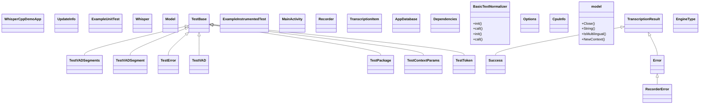

[⬅ Previous](./05-model-serving.md) | [🏠 Index](./README.md) | [Next ➡](./07-evaluation.md)

# 06 - Data Persistence 💾

Transcriber uses two main technologies for data persistence: **Room** for structured data and **DataStore** for user preferences.

## 1. Room (Transcription History)

The history is stored in a SQLite database via Room.

### Entity: `TranscriptionItem`
- `id`: Auto-generated primary key.
- `timestamp`: Long (milliseconds).
- `text`: The full transcript.

### DAO: `TranscriptionDao`
Provides methods for:
- `getAll()`: Returns a `Flow<List<TranscriptionItem>>` for real-time UI updates.
- `insert()`: Adds a new record.
- `deleteById()`: Removes a specific entry.
- `clearAll()`: Wipes the history.

## 2. Jetpack DataStore (Settings)

Preferences are managed by `PreferenceManager` using `preferencesDataStore`.

### Tracked Settings:
- `apiKey`: The Gemini API key.
- `language`: Target transcription language.
- `transcriptionEngine`: "cloud", "litert", or "aicore".
- `selectedModelId`: The ID of the currently active LiteRT model.
- `uiOpacity`: Background transparency level for the overlay.
- `appTheme`: "System", "Light", or "Dark".

### Why DataStore?
- **Asynchronous**: Built on Coroutines and Flow, preventing UI jank.
- **Safe**: Handles data updates atomically.
- **Migration**: Easier migration paths compared to SharedPreferences.

## 3. Model Management

LiteRT models are large files (2GB+). They are stored in the app's internal storage (`context.filesDir/models`).
`ModelRepository` manages:
- Downloading models via `DownloadManager`.
- Verifying file integrity.
- Calculating available space.
- Mapping model IDs to local file paths.

## Class Diagram

[⬅ Previous](./05-model-serving.md) | [🏠 Index](./README.md) | [Next ➡](./07-evaluation.md)